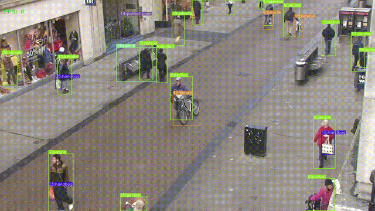

# YOLOv5 Object Tracking

Multiple object tracking with YOLOv5 and SORT. 

This repository is created from https://github.com/haroonshakeel/yolov7-object-tracking

# Object Tracking Results ``YOLOv5`` Weights

<!-- 

 -->

# TO DO
* [] Refactor Inference Code(detect_or_track.py) from yolov7 to yolov5
* [] Write Read Me how to use this repo

# Credits  
  * [ultralytics Yolov5 Repo](https://github.com/ultralytics/yolov5)
  * [haroonshakell yolov7-object-tracking Repo](https://github.com/haroonshakeel/yolov7-object-tracking)
  * [RizwanMunawar Yolov7 Object Tracking Repo](https://github.com/RizwanMunawar/yolov7-object-tracking)
  * [abewley SORT Repo](https://github.com/abewley/sort)
  * [TheAIGuy DeepSort Repo](https://github.com/theAIGuysCode/yolov4-deepsort)
